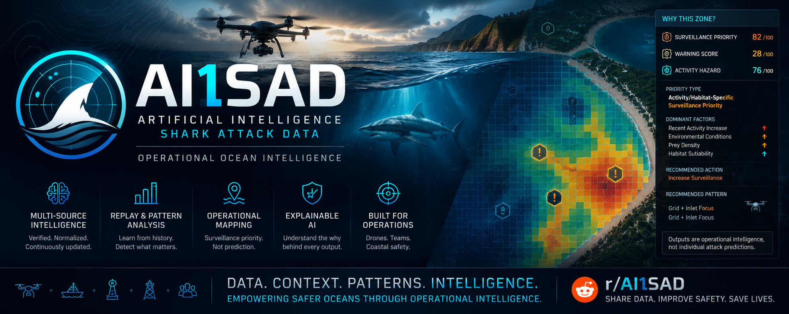
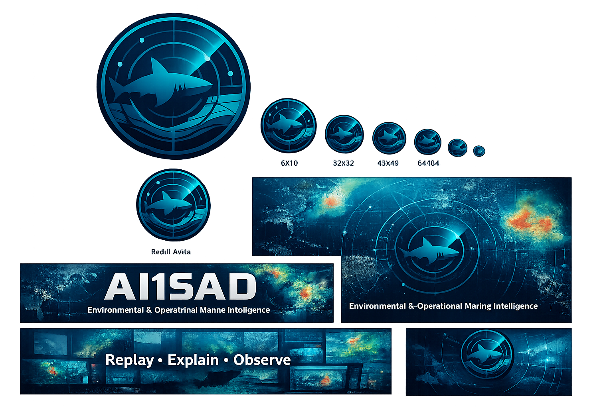
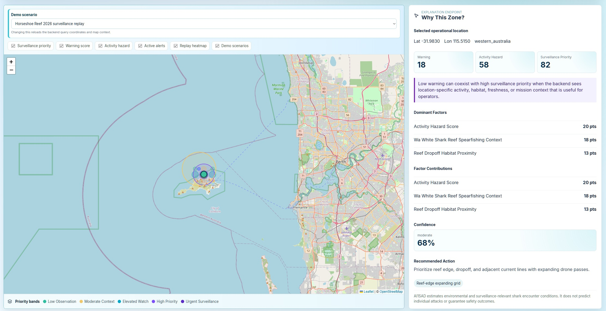
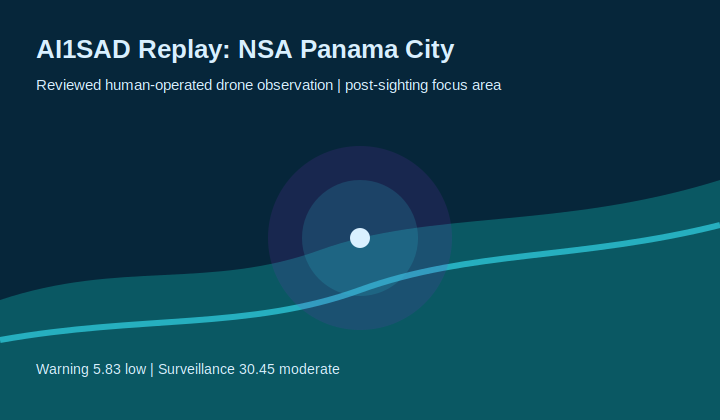
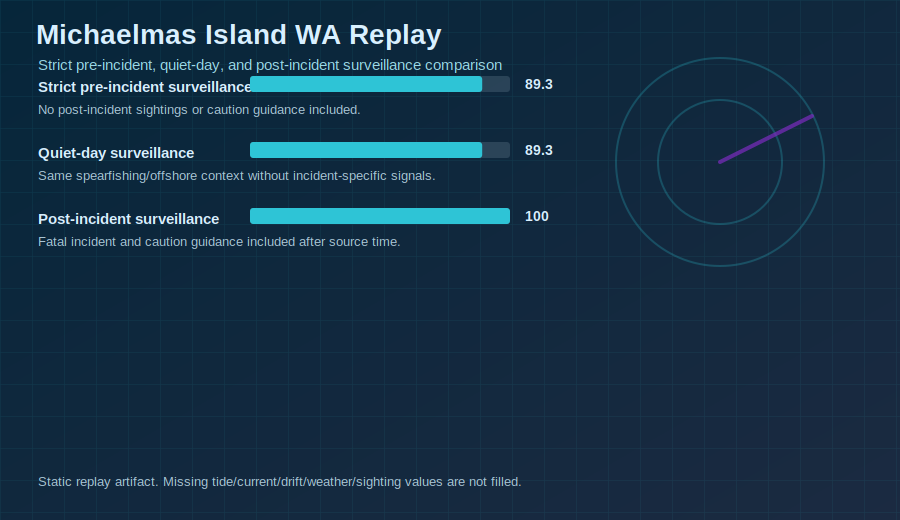
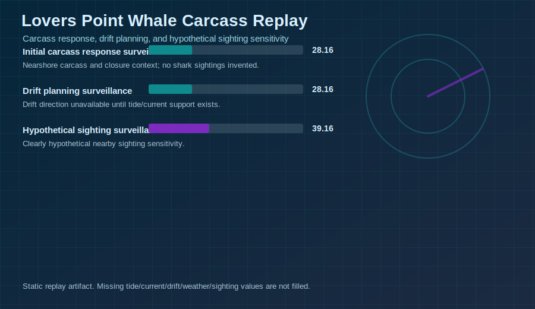

# AI1SAD

## All in 1 Shark Attack Data

<p align="center">
  
</p>

AI1SAD is a marine intelligence platform for shark-encounter data, environmental context, replay analysis, and operational surveillance planning.

It combines historical incidents, regional profiles, environmental signals, habitat context, biological events, human exposure, replay case studies, and human-operated drone observation intake into a single FastAPI, frontend, and documentation workspace.

AI1SAD does not predict individual incidents or infer shark intent. It separates calm public warning posture from operational surveillance-priority context for human review.

## Current Status

Current development checkpoint:

- Latest completed phase: Phase 25D-A, Observation Analyst Review Fields
- Latest completed maintenance: targeted Dependabot esbuild alert patch
- Current implementation: Phase 25D-A, metadata-only analyst review fields
- Next planned phase: Phase 25D-B, Drone Observation Media References (future)
- Local demo frontend: <http://localhost:5174>
- FastAPI docs: <http://localhost:8000/docs>
- MkDocs portal: <http://localhost:8001>

See:

- [Project Status](docs/PROJECT_STATUS.md)
- [Next Phase](docs/NEXT_PHASE.md)
- [Local Visual QA](docs/LOCAL_VISUAL_QA.md)

## Visual Preview

### Brand System

<p align="center">
  
</p>

Canonical source artwork lives in [images/branding](images/branding). Deployment copies for the docs portal and frontend live under [docs/assets/brand](docs/assets/brand) and [frontend/public/brand](frontend/public/brand).

### Replay And Operational Heatmaps

| Horseshoe Reef, Western Australia | NSA Panama City Drone Fixture |
| --- | --- |
|  |  |

| Michaelmas Island, WA | Lovers Point Whale Carcass |
| --- | --- |
|  |  |

Additional replay artifacts live in [docs/assets/case_studies](docs/assets/case_studies).

## What Is Included

- FastAPI backend with public API routes and privacy filtering
- MongoDB collection/index definitions for incidents, signals, alerts, replay, regional packs, and drone observation intake
- React/Vite frontend dashboard for the local AI1SAD demo
- MkDocs documentation portal with branded theme and case-study pages
- Replay library with timeline-separated historical and demo scenarios
- Explainability engine and confidence decomposition
- Warning, activity-hazard, surveillance-priority, and alert outputs
- Regional packs for Florida, Hawaii, Western Australia, Queensland, South Africa, Red Sea, New South Wales, U.S. East Coast, California, and Brazil/Recife planning
- Static/offline adapters for biological events, vessel/fishing context, human exposure, kelp forest habitat, Hawaii habitat, Hawaii tide/current context, and Hawaii water clarity/turbidity context
- Vendor-neutral human-operated drone observation ingestion MVP
- Drone Operator Console for human-entered patrol observations, including shark sightings, no-sighting patrols, carcasses, baitfish activity, poor visibility, and surf-line activity. AI1SAD records observations and recommends surveillance attention; it does not control aircraft or predict individual attacks.
- Metadata-only analyst review fields for annotating observations with review status, outcome, public summary, and private notes
- Read-only MAVLink telemetry bridge for local fixture replay into existing telemetry endpoints
- One-click Windows local demo launcher and stop scripts

## Local Demo

### One-Click Windows Launcher

From the repo root, double-click:

```text
start_ai1sad_demo.bat
```

This starts:

- Backend: <http://localhost:8000>
- FastAPI docs: <http://localhost:8000/docs>
- Frontend: <http://localhost:5174>
- MkDocs: <http://localhost:8001>

It also opens browser tabs for the frontend, FastAPI docs, and docs portal. FretTrack may occupy `5173`, so AI1SAD uses `5174` for the frontend.

Stop the local demo with:

```text
stop_ai1sad_demo.bat
```

### Manual Run

Backend:

```powershell
python3 -m uvicorn app.main:app --reload --host 0.0.0.0 --port 8000
```

Windows fallback:

```powershell
F:\Python310\python.exe -m uvicorn app.main:app --reload --host 0.0.0.0 --port 8000
```

Frontend:

```powershell
cd frontend
npm install
npm run dev -- --host 0.0.0.0 --port 5174
```

MkDocs:

```powershell
mkdocs serve --dev-addr 0.0.0.0:8001
```

## Core API Areas

- `/api/v1/incidents`
- `/api/v1/stats/yearly`
- `/api/v1/stats/by-country`
- `/api/v1/stats/by-region`
- `/api/v1/stats/by-activity`
- `/api/v1/stats/by-species`
- `/api/v1/locations/nearby`
- `/api/v1/sources`
- `/api/v1/risk/location`
- `/api/v1/warnings/location`
- `/api/v1/warnings/explain`
- `/api/v1/surveillance/search-zones`
- `/api/v1/surveillance/explain`
- `/api/v1/alerts/active`
- `/api/v1/alerts/evaluate`
- `/api/v1/packs`
- `/api/v1/signals/location`
- `/api/v1/provider-health`
- `/api/v1/replay/library`
- `/api/v1/replay/run/{scenario_id}`
- `/api/v1/drone/active-observations`
- `/api/v1/drone/surveillance-feed`

Drone write endpoints are disabled by default unless `DRONE_INGEST_ENABLED=true`.

## Replay Library

The replay library presents evidence-backed operational scenarios with:

- strict timeline separation
- quiet-day comparisons
- factor summaries
- confidence breakdowns
- model/version metadata
- replay JSON artifacts
- heatmap SVG assets
- disclaimers and missing-data notes

Current case-study coverage includes:

- [Horseshoe Reef 2026](docs/CASE_STUDY_HORSESHOE_REEF_2026.md)
- [Plumpudding Beach Esperance Whale Carcass 2026](docs/case_studies/plumpudding_beach_esperance_whale_carcass_2026.md)
- [Piedade and Boa Viagem Recife 2026](docs/case_studies/piedade_boa_viagem_recife_2026.md)
- [Michaelmas Island Albany WA 2026](docs/case_studies/michaelmas_island_albany_wa_2026.md)
- [Lovers Point Pacific Grove Whale Carcass 2026](docs/case_studies/lovers_point_pacific_grove_whale_carcass_2026.md)
- [NSA Panama City Florida 2026 Drone Observation Fixture](docs/case_studies/nsa_panama_city_florida_2026.md)
- [Queensland Spearfishing 2026](docs/case_studies/queensland_spearfishing_2026.md)

See the full [Replay Library](docs/REPLAY_LIBRARY.md).

## Drone Observation Intake

Phase 25A adds a vendor-neutral observation-ingestion path for human-operated coastal-surveillance drones. Phase 25C adds a local Drone Operator Console at `/drone-console` for human-entered patrol observations:

- mission records
- telemetry points
- source-attributed observations
- no-sighting patrol caveats
- review status
- probable species metadata with provenance
- no-sighting patrol semantics
- public-safe active-observation feed
- surveillance-feed integration
- replay fixture support

AI1SAD supports human-approved surveillance decisions. It does not control aircraft or predict individual attacks.

It does not add:

- autonomous takeoff or landing
- waypoint execution
- offboard flight control
- MAVLink support yet
- DJI-specific dependencies
- computer vision inference
- file upload or image hosting

See:

- [Drone Operator Console](docs/DRONE_OPERATOR_CONSOLE.md)
- [Drone Observation Ingestion](docs/DRONE_OBSERVATION_INGESTION.md)
- [Observation Analyst Review](docs/OBSERVATION_ANALYST_REVIEW.md)
- [Drone Mission Workflow](docs/DRONE_MISSION_WORKFLOW.md)
- [Drone Data Contract](docs/DRONE_DATA_CONTRACT.md)
- [Drone Operations Safety](docs/DRONE_OPERATIONS_SAFETY.md)
- [MAVLink Telemetry Bridge](docs/MAVLINK_TELEMETRY_BRIDGE.md)

## Safety And Privacy

AI1SAD is designed for research, documentation, replay analysis, and operational planning. It is not a replacement for official beach, lifeguard, maritime, wildlife, or emergency guidance.

Public API responses must not expose:

- victim names
- private notes
- internal analyst notes
- restricted-source content
- exact sensitive addresses
- MongoDB credentials
- provider API keys
- private media paths
- raw exception details

Operational recommendations require human review. Scores support interpretation and prioritization; they do not guarantee safety outcomes.

## Validation Snapshot

Latest validation is recorded in [Project Status](docs/PROJECT_STATUS.md).

Phase 25C local validation:

- Frontend tests: `4 passed`, `17 tests passed`
- Frontend build: passed
- Frontend audit: `0 vulnerabilities`
- Focused drone-ingestion tests: `11 passed, 1 warning`
- Focused MAVLink bridge tests: `11 passed`
- Full backend tests: `256 passed, 3 warnings`
- MkDocs build: passed with the known Material advisory banner
- README link/image check: passed

## Documentation Map

- [API](docs/API.md)
- [Schema](docs/SCHEMA.md)
- [Privacy](docs/PRIVACY.md)
- [Usage Policy](docs/USAGE_POLICY.md)
- [Disclaimer](docs/DISCLAIMER.md)
- [Data Quality](docs/DATA_QUALITY.md)
- [Current Data Sources](docs/CURRENT_DATA_SOURCES.md)
- [Replay Library](docs/REPLAY_LIBRARY.md)
- [Surveillance Engine](docs/SURVEILLANCE_ENGINE.md)
- [Explainability Engine](docs/EXPLAINABILITY_ENGINE.md)
- [Alert Engine](docs/ALERT_ENGINE.md)
- [Regional Packs](docs/REGIONAL_PACKS.md)
- [Provider Health](docs/PROVIDER_HEALTH.md)
- [Frontend Dashboard](docs/FRONTEND_DASHBOARD.md)
- [Brand Identity](docs/BRAND_IDENTITY.md)
- [Brand Deployment Map](docs/BRAND_DEPLOYMENT_MAP.md)
- [Dependency Security Review](docs/DEPENDENCY_SECURITY_REVIEW.md)
- [Drone Operator Console](docs/DRONE_OPERATOR_CONSOLE.md)

## Development Notes

Install backend dependencies:

```powershell
python -m venv .venv
.\.venv\Scripts\Activate.ps1
pip install -r requirements.txt
copy .env.example .env
```

Required local environment values:

```text
MONGODB_URI=<your-mongodb-atlas-connection-string>
MONGODB_DATABASE=AI1SAD
SHARK_ATTACK_API_TITLE=AI1SAD Shark Attack Data API
ADMIN_EVENTS_ENABLED=false
ADMIN_SURVEILLANCE_ENABLED=false
ADMIN_ALERTS_ENABLED=false
DRONE_INGEST_ENABLED=false
```

Run backend tests:

```powershell
python -m pytest -q
```

Run frontend tests/build:

```powershell
cd frontend
npm test
npm run build
```

Build docs:

```powershell
mkdocs build
```

## License

AI1SAD code is licensed under the [Apache License 2.0](LICENSE). Data sources, incident records, public advisories, imagery, and third-party datasets may have separate licenses, terms, attribution requirements, and privacy restrictions.
