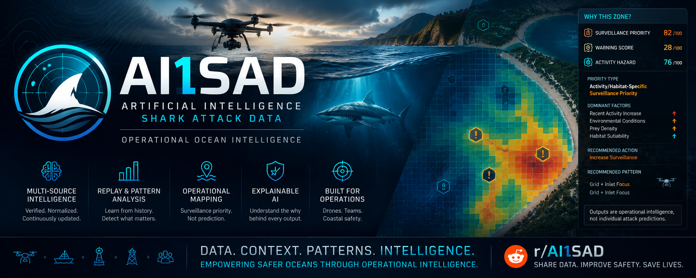
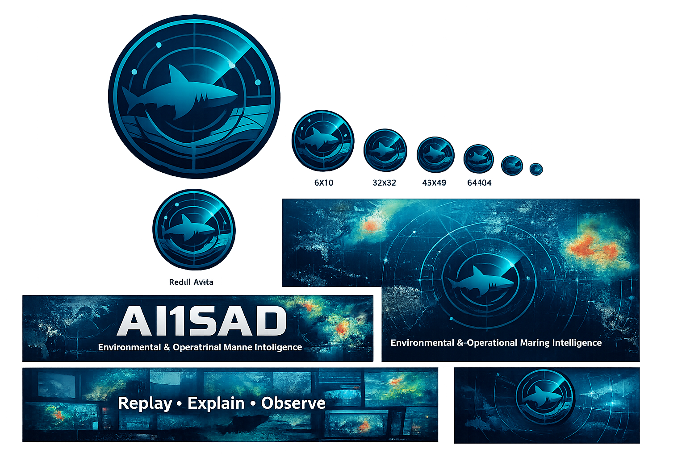
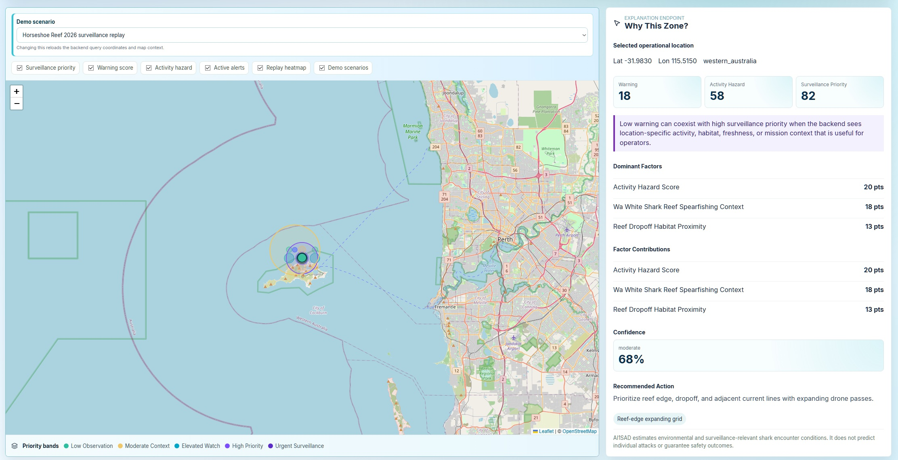
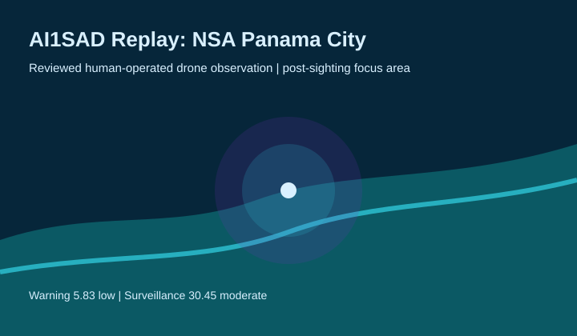
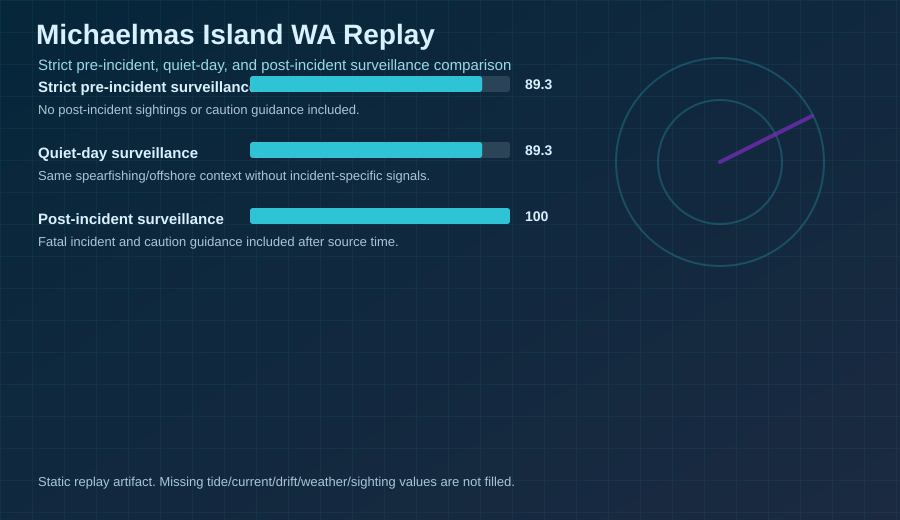
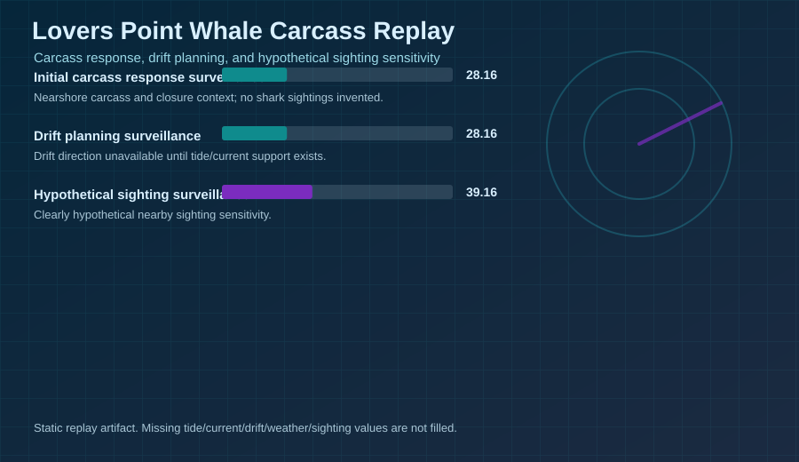

# AI1SAD

## All in 1 Shark Attack Data

<p align="center">
  
</p>

AI1SAD is a marine intelligence platform for shark-encounter data, environmental context, replay analysis, and operational surveillance planning.

It combines historical incidents, regional profiles, environmental signals, habitat context, biological events, human exposure, replay case studies, and human-operated drone observation intake into a single FastAPI, frontend, and documentation workspace.

AI1SAD does not predict individual incidents or infer shark intent. It separates calm public warning posture from operational surveillance-priority context for human review.

## Current Status

Current development checkpoint:

- Latest completed phase: Phase 26B, AI1SAD Shark-Human Incident Registry Schema
- Latest completed maintenance: Phase 26A follow-up backend freshness stabilization
- Current implementation: 2000-2026 Incident Globe built on the Phase 26C source foundation
- Next planned phase: Phase 26D, Vic Hislop Corpus and Case-Claim Archive
- Target full working-version launch: September 7, 2026.
- Local demo frontend: <http://localhost:5174>
- Incident Globe: <http://localhost:5174/incident-globe>
- Production frontend: <https://ai1sad.org>
- Production API: <https://api.ai1sad.org>
- Production documentation: `docs.ai1sad.org` pending deployment
- FastAPI docs: <http://localhost:8000/docs>
- MkDocs portal: <http://localhost:8001>

AI1SAD is targeting a full working-version launch on September 7, 2026. Current development is focused on evidence provenance, staged upstream data review, replay explainability, UAV operator workflows, and public-safe surveillance outputs.

See:

- [Project Status](docs/PROJECT_STATUS.md)
- [Next Phase](docs/NEXT_PHASE.md)
- [Local Visual QA](docs/LOCAL_VISUAL_QA.md)
- [AI1SAD.org Deployment](docs/CLOUDFLARE_DEPLOY.md)
- [Render Deployment](docs/RENDER_DEPLOY.md)

## Visual Preview

### Brand System

<p align="center">
  
</p>

Canonical source artwork lives in [images/branding](images/branding). Deployment copies for the docs portal and frontend live under [docs/assets/brand](docs/assets/brand) and [frontend/public/brand](frontend/public/brand).

### Replay And Operational Heatmaps

| Horseshoe Reef, Western Australia | NSA Panama City Drone Fixture |
| --- | --- |
|  |  |

| Michaelmas Island, WA | Lovers Point Whale Carcass |
| --- | --- |
|  |  |

Additional replay artifacts live in [docs/assets/case_studies](docs/assets/case_studies).

## What Is Included

- FastAPI backend with public API routes and privacy filtering
- MongoDB collection/index definitions for incidents, signals, alerts, replay, regional packs, drone observation intake, internal archival-source metadata, and the private Sharks Happen source lane
- React/Vite frontend dashboard for the local AI1SAD demo
- MkDocs documentation portal with branded theme and case-study pages
- Replay library with timeline-separated historical and demo scenarios
- Explainability engine and confidence decomposition
- Warning, activity-hazard, surveillance-priority, and alert outputs
- Regional packs for Florida, Hawaii, Western Australia, Queensland, South Africa, Red Sea, New South Wales, U.S. East Coast, California, and Brazil/Recife planning
- Static/offline adapters for biological events, vessel/fishing context, human exposure, kelp forest habitat, Hawaii habitat, Hawaii tide/current context, and Hawaii water clarity/turbidity context
- Vendor-neutral human-operated drone observation ingestion MVP
- Drone Operator Console for human-entered patrol observations, including shark sightings, no-sighting patrols, carcasses, baitfish activity, poor visibility, and surf-line activity. AI1SAD records observations and recommends surveillance attention; it does not control aircraft or predict individual attacks.
- Metadata-only analyst review fields for annotating observations with review status, outcome, public summary, and private notes
- Local-only media attachment prototype is available behind an explicit configuration gate. Attachments are private by default and are not exposed through public feeds. AI1SAD does not analyze media, infer species, or create sightings from attachments.
- UAV Operator Feedback Intake collects real-world workflow notes from drone operators, lifeguards, researchers, and coastal teams. Feedback is treated as research input only; it does not create sightings, warnings, or public alerts.
- GSAF local import and delta tracking reads manually downloaded `.csv`, `.xlsx`, or `.xls` files into internal staging JSON, preserves source provenance, computes row fingerprints, and reports new, changed, unchanged, duplicate, malformed, and possibly removed upstream rows. Imported rows do not create warnings, alerts, replay facts, drone observations, public feed entries, or scoring changes.
- Internal Shark-Human Incident Registry schema links reviewed AI1SAD case records to GSAF staging rows, future archival newspaper metadata, future Vic Hislop corpus claims, source conflicts, official species status, internal species hypotheses, retaliation-risk species-disclosure guardrails, behavioral hypotheses, confidence labels, public summaries, and private analyst notes. It now includes the first restricted real-world seed case for the September 14, 2026 Glenfield Beach incident involving Mel Ismail, preserving source links while keeping species unconfirmed, storing no internal species hypothesis, and avoiding shark-intent claims. Registry records do not create warnings, alerts, replay facts, drone observations, public feed entries, or scoring changes.
- Australian Archival News Tracker captures local/manual metadata for historical newspaper and public-record evidence, preserving citations, rights state, OCR uncertainty, duplicate/reprint context, source conflicts, source confidence, and registry source-link metadata. It includes a local JSON/CSV CLI importer that writes metadata-only staging/report JSON under `data/imports/archival_news/` and can optionally persist accepted records to internal MongoDB collections with `--mongo`. It does not scrape Trove, use the Trove API, bulk-download article bodies, store full article text, expose public archival endpoints, create warnings or alerts, alter scoring, change replay artifacts, create public feed entries, or create drone observations.
- Sharks Happen source intake preserves Hal's supplied `Sharks Happen Stats.xlsx` rows as attributed, internal source claims. The importer writes a private staging artifact and duplicate-review CSV, compares rows with the existing 40,309-row normalized incident database, and can upsert the source records into separate MongoDB collections. Candidate matches are not automatically merged, promoted, published, or treated as confirmed facts.
- Incident Globe provides a professional 3D explorer for 3,398 deduplicated incidents from 2000 through 2026, with decade, Provoked/Unprovoked, and four bounded outcome filters. It plots 1,811 records with supported coordinates and retains 1,587 unresolved records without inventing locations. Country-envelope validation rejects 104 impossible approximate geocode-cache matches while preserving the underlying records for later human review. Clickable infographics show scrubbed incident fields and all available source attribution. It does not change warning scoring, alerts, replay outputs, species findings, or source claims. See [Incident Globe](docs/INCIDENT_GLOBE.md).
- AI1SAD is planning a Vic Hislop corpus archive for shark-attack case claims, interviews, writings, and museum-era records. These sources will support provenance and behavioral hypothesis review, not automatic shark-intent conclusions.
- Read-only MAVLink telemetry bridge for local fixture replay into existing telemetry endpoints
- One-click Windows local demo launcher and stop scripts

## Local Demo

### One-Click Windows Launcher

From the repo root, double-click:

```text
start_ai1sad_demo.bat
```

This starts:

- Backend: <http://localhost:8000>
- FastAPI docs: <http://localhost:8000/docs>
- Frontend: <http://localhost:5174>
- MkDocs: <http://localhost:8001>

It also opens browser tabs for the frontend, FastAPI docs, and docs portal. FretTrack may occupy `5173`, so AI1SAD uses `5174` for the frontend.

Stop the local demo with:

```text
stop_ai1sad_demo.bat
```

### Manual Run

Backend:

```powershell
python3 -m uvicorn app.main:app --reload --host 0.0.0.0 --port 8000
```

Windows fallback:

```powershell
F:\Python310\python.exe -m uvicorn app.main:app --reload --host 0.0.0.0 --port 8000
```

Frontend:

```powershell
cd frontend
npm install
npm run dev -- --host 0.0.0.0 --port 5174
```

MkDocs:

```powershell
mkdocs serve --dev-addr 0.0.0.0:8001
```

## Core API Areas

- `/api/v1/incidents`
- `/api/v1/incidents-globe`
- `/api/v1/stats/yearly`
- `/api/v1/stats/by-country`
- `/api/v1/stats/by-region`
- `/api/v1/stats/by-activity`
- `/api/v1/stats/by-species`
- `/api/v1/locations/nearby`
- `/api/v1/sources`
- `/api/v1/risk/location`
- `/api/v1/warnings/location`
- `/api/v1/warnings/explain`
- `/api/v1/surveillance/search-zones`
- `/api/v1/surveillance/explain`
- `/api/v1/alerts/active`
- `/api/v1/alerts/evaluate`
- `/api/v1/packs`
- `/api/v1/signals/location`
- `/api/v1/provider-health`
- `/api/v1/replay/library`
- `/api/v1/replay/run/{scenario_id}`
- `/api/v1/drone/active-observations`
- `/api/v1/drone/surveillance-feed`
- `/api/v1/uav/operator-feedback`

Drone write endpoints are disabled by default unless `DRONE_INGEST_ENABLED=true`.

Local GSAF intake is a script entry point, not a public API route:

```powershell
F:\Python310\python.exe -m app.services.gsaf_importer --input data/imports/gsaf/raw/latest_gsaf.xls --report data/imports/gsaf/reports/latest_import_report.json
```

Raw GSAF spreadsheets and generated staging/report artifacts stay local under `data/imports/gsaf/` and must not be committed unless rights are explicitly approved.

The Phase 26B incident registry is an internal service/schema foundation, not a public ingestion route. The Glenfield Beach seed case is internal/restricted registry data and does not create an alert, warning, public-feed observation, replay artifact, or API endpoint.

Open the local internal registry viewer by double-clicking `AI1SAD_Registry.exe` or running:

```powershell
.\AI1SAD_Registry.exe
```

The viewer renders the real registry cases, evidence notes, source links, species status, behavioral uncertainty, and Mongo archival-source counts in the browser. It reads local repository records and configured MongoDB metadata; it does not publish a registry endpoint. Rebuild the launcher with `powershell -NoProfile -ExecutionPolicy Bypass -File .\build_ai1sad_registry_exe.ps1`.

The Phase 26C archival news tracker is also an internal local/manual service foundation, not a public ingestion route or source connector. It includes Windows launchers:

```powershell
.\run_archival_news_import.exe --prompt-mongo
```

The launcher prompts for MongoDB Atlas host, database username, and password when credentials are not already available through `.env` or environment variables. It builds `MONGODB_URI` in memory for that run only and does not write the password to disk.

It can also import manually prepared `.json` or `.csv` metadata into local staging/report files:

```powershell
F:\Python310\python.exe -m app.services.archival_news_tracker --input data/imports/archival_news/raw/example_archival_sources.json
```

With MongoDB configured, accepted metadata records and sanitized import reports can also be persisted internally:

```powershell
F:\Python310\python.exe -m app.services.archival_news_tracker --input data/imports/archival_news/raw/example_archival_sources.json --mongo
```

The importer executable is a small wrapper around `run_archival_news_import.bat`, which delegates to `run_archival_news_import.ps1`; the batch wrapper keeps the console open after double-click runs so errors and reports remain visible. After a successful import it opens the local registry viewer. Pass `--no-viewer` for command-line or automated imports that should not open a browser. Rebuild it with:

```powershell
powershell -NoProfile -ExecutionPolicy Bypass -File .\build_archival_news_import_exe.ps1
```

Raw archival metadata and generated staging/report artifacts stay local under `data/imports/archival_news/` and must not be committed unless rights are explicitly approved. The tracker does not scrape Trove, use the Trove API, download article bodies, or create public API endpoints. Future public registry or archival endpoints require a separate reviewed phase.

Import the private Sharks Happen workbook, compare duplicate candidates, and persist it to configured MongoDB with:

```powershell
F:\Python310\python.exe -m app.services.sharks_happen_importer --input "data/imports/sharks_happen/raw/Sharks Happen Stats.xlsx" --mongo
```

The duplicate review queue is written to `data/imports/sharks_happen/reports/latest_duplicate_review.csv`. Raw workbooks, staging JSON, reports, victim names, and source-specific claims remain ignored local data. See [Sharks Happen Source Intake](docs/SHARKS_HAPPEN_SOURCE.md).

## Replay Library

The replay library presents evidence-backed operational scenarios with:

- strict timeline separation
- quiet-day comparisons
- factor summaries
- confidence breakdowns
- model/version metadata
- replay JSON artifacts
- heatmap SVG assets
- disclaimers and missing-data notes

Current case-study coverage includes:

- [Horseshoe Reef 2026](docs/CASE_STUDY_HORSESHOE_REEF_2026.md)
- [Plumpudding Beach Esperance Whale Carcass 2026](docs/case_studies/plumpudding_beach_esperance_whale_carcass_2026.md)
- [Piedade and Boa Viagem Recife 2026](docs/case_studies/piedade_boa_viagem_recife_2026.md)
- [Michaelmas Island Albany WA 2026](docs/case_studies/michaelmas_island_albany_wa_2026.md)
- [Lovers Point Pacific Grove Whale Carcass 2026](docs/case_studies/lovers_point_pacific_grove_whale_carcass_2026.md)
- [NSA Panama City Florida 2026 Drone Observation Fixture](docs/case_studies/nsa_panama_city_florida_2026.md)
- [Queensland Spearfishing 2026](docs/case_studies/queensland_spearfishing_2026.md)

See the full [Replay Library](docs/REPLAY_LIBRARY.md).

## Drone Observation Intake

Phase 25A adds a vendor-neutral observation-ingestion path for human-operated coastal-surveillance drones. Phase 25C adds a local Drone Operator Console at `/drone-console` for human-entered patrol observations:

- mission records
- telemetry points
- source-attributed observations
- no-sighting patrol caveats
- review status
- probable species metadata with provenance
- no-sighting patrol semantics
- public-safe active-observation feed
- surveillance-feed integration
- replay fixture support

AI1SAD supports human-approved surveillance decisions. It does not control aircraft or predict individual attacks.

### Consumer Drone App Compatibility

AI1SAD can work alongside any consumer drone flight app through the manual operator workflow. The pilot flies normally using the drone's own app, controller, or manufacturer software. AI1SAD does not need that app to expose an API. The operator records observations in the AI1SAD Drone Operator Console while the drone is flown manually.

This is not the same as direct SDK/API integration. Consumer drone app compatibility means AI1SAD supports the patrol workflow, not that AI1SAD controls the aircraft or reads private app telemetry.

| Drone / Flight App Type                       | AI1SAD Support Path                                         | API Required?           |
| --------------------------------------------- | ----------------------------------------------------------- | ----------------------- |
| Any consumer drone flight app                 | Manual Drone Operator Console + media/evidence reference    | No                      |
| DJI Fly / DJI Pilot                           | Manual workflow now; future read-only SDK research possible | No for current workflow |
| Ophelia GO / M RC PRO / Holy Stone-class apps | Manual workflow only + post-flight media reference          | No                      |
| Generic Wi-Fi camera drone apps               | Manual workflow + map-pin observation                       | No                      |
| ArduPilot / PX4 / Pixhawk                     | Read-only MAVLink telemetry bridge                          | Yes, MAVLink            |

AI1SAD works with consumer drone apps by running beside them, not inside them.

AI1SAD recommends surveillance attention.
Humans approve missions.
Drone operators fly missions.
AI1SAD ingests observations.

AI1SAD does not:

- control consumer drone apps
- autonomously fly aircraft
- bypass manufacturer software
- require drone-app API access for manual workflows
- create shark sightings from telemetry alone
- fetch or analyze media
- predict individual shark attacks

It also does not add:

- autonomous takeoff or landing
- waypoint execution
- offboard flight control
- MAVLink command transmission
- DJI-specific dependencies
- computer vision inference
- file upload or image hosting
- public media attachment release or binary media upload

See:

- [UAV Operator Research Brief](docs/UAV_OPERATOR_RESEARCH_BRIEF.md)
- [UAV Compatibility Matrix](docs/UAV_COMPATIBILITY_MATRIX.md)
- [UAV Operator Feedback Intake](docs/UAV_OPERATOR_FEEDBACK_INTAKE.md)
- [Drone Operator Console](docs/DRONE_OPERATOR_CONSOLE.md)
- [Drone Observation Ingestion](docs/DRONE_OBSERVATION_INGESTION.md)
- [Observation Analyst Review](docs/OBSERVATION_ANALYST_REVIEW.md)
- [Local Media Attachment Prototype](docs/LOCAL_MEDIA_ATTACHMENT_PROTOTYPE.md)
- [Media Attachment Storage Design](docs/MEDIA_ATTACHMENT_STORAGE_DESIGN.md)
- [Drone Mission Workflow](docs/DRONE_MISSION_WORKFLOW.md)
- [Drone Data Contract](docs/DRONE_DATA_CONTRACT.md)
- [Drone Operations Safety](docs/DRONE_OPERATIONS_SAFETY.md)
- [MAVLink Telemetry Bridge](docs/MAVLINK_TELEMETRY_BRIDGE.md)

## Safety And Privacy

AI1SAD is designed for research, documentation, replay analysis, and operational planning. It is not a replacement for official beach, lifeguard, maritime, wildlife, or emergency guidance.

Public API responses must not expose:

- victim names
- private notes
- internal analyst notes
- restricted-source content
- exact sensitive addresses
- MongoDB credentials
- provider API keys
- private media paths
- raw exception details

Operational recommendations require human review. Scores support interpretation and prioritization; they do not guarantee safety outcomes.

## Validation Snapshot

Latest validation is recorded in [Project Status](docs/PROJECT_STATUS.md).

Phase 26C local validation:

- Focused archival tracker tests: `12 passed`
- Focused incident registry and local viewer tests: `17 passed`
- Full backend tests: `325 passed, 3 warnings`
- Frontend tests/build: `30 passed`; production build passed
- Tracker behavior: internal local/manual metadata helpers with optional Mongo persistence and Windows `.bat`/`.exe` launchers only; no public ingestion route, public archival endpoint, source scraping, Trove API use, article-body download, raw OCR storage, warning/alert/scoring/replay/feed/drone side effects, provider adapter changes, fixture changes, public speculative species attribution, or shark-intent claim.
- MkDocs build: passed with the known Material advisory banner
- README local links/images check: `56` checked, passed
- Secret scan: no credential patterns matched
- Prohibited-language scan: guardrail/disclaimer matches only
- Git whitespace check: passed with CRLF normalization warnings only

Sharks Happen source intake validation is recorded in [Project Status](docs/PROJECT_STATUS.md). The current real import contains `864` source rows and produced `162` exact duplicate candidates, `435` likely candidates, `267` unmatched rows, and `8` rows participating in possible within-workbook repeats; no automatic merges or registry promotions occurred.

## Documentation Map

- [API](docs/API.md)
- [Schema](docs/SCHEMA.md)
- [Privacy](docs/PRIVACY.md)
- [Usage Policy](docs/USAGE_POLICY.md)
- [Disclaimer](docs/DISCLAIMER.md)
- [Data Quality](docs/DATA_QUALITY.md)
- [Current Data Sources](docs/CURRENT_DATA_SOURCES.md)
- [GSAF Import And Delta Tracking](docs/GSAF_IMPORT_AND_DELTA_TRACKING.md)
- [Sharks Happen Source Intake](docs/SHARKS_HAPPEN_SOURCE.md)
- [Shark-Human Incident Registry](docs/SHARK_HUMAN_INCIDENT_REGISTRY.md)
- [Australian Archival News Tracker](docs/AUSTRALIAN_ARCHIVAL_NEWS_TRACKER.md)
- [Vic Hislop Corpus Archive](docs/VIC_HISLOP_CORPUS_ARCHIVE.md)
- [Replay Library](docs/REPLAY_LIBRARY.md)
- [Surveillance Engine](docs/SURVEILLANCE_ENGINE.md)
- [Explainability Engine](docs/EXPLAINABILITY_ENGINE.md)
- [Alert Engine](docs/ALERT_ENGINE.md)
- [Regional Packs](docs/REGIONAL_PACKS.md)
- [Provider Health](docs/PROVIDER_HEALTH.md)
- [Frontend Dashboard](docs/FRONTEND_DASHBOARD.md)
- [Brand Identity](docs/BRAND_IDENTITY.md)
- [Brand Deployment Map](docs/BRAND_DEPLOYMENT_MAP.md)
- [Dependency Security Review](docs/DEPENDENCY_SECURITY_REVIEW.md)
- [Media Attachment Storage Design](docs/MEDIA_ATTACHMENT_STORAGE_DESIGN.md)
- [Drone Operator Console](docs/DRONE_OPERATOR_CONSOLE.md)

## Development Notes

Install backend dependencies:

```powershell
python -m venv .venv
.\.venv\Scripts\Activate.ps1
pip install -r requirements.txt
copy .env.example .env
```

Required local environment values:

```text
MONGODB_URI=<your-mongodb-atlas-connection-string>
MONGODB_DATABASE=AI1SAD
SHARK_ATTACK_API_TITLE=AI1SAD Shark Attack Data API
ADMIN_EVENTS_ENABLED=false
ADMIN_SURVEILLANCE_ENABLED=false
ADMIN_ALERTS_ENABLED=false
DRONE_INGEST_ENABLED=false
```

Run backend tests:

```powershell
python -m pytest -q
```

Run frontend tests/build:

```powershell
cd frontend
npm test
npm run build
```

Build docs:

```powershell
mkdocs build
```

## License

AI1SAD code is licensed under the [Apache License 2.0](LICENSE). Data sources, incident records, public advisories, imagery, and third-party datasets may have separate licenses, terms, attribution requirements, and privacy restrictions.
[](https://devglobe.app/projects/ai1sad?utm_source=badge&utm_medium=embed)
