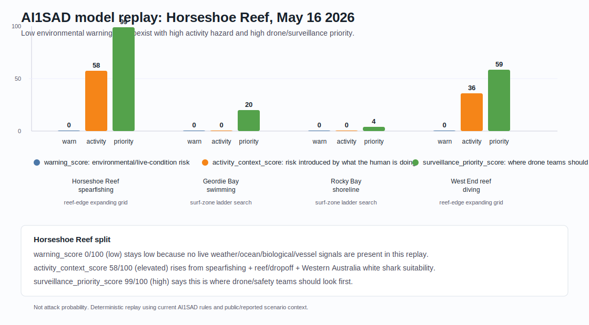

# Case Study: Horseshoe Reef Model Replay

This case study shows how AI1SAD separates environmental warning, human activity hazard, and surveillance prioritization for the fatal May 16, 2026 shark attack at Horseshoe Reef near Rottnest Island, Western Australia.

This is not an attack-probability claim. It is a deterministic replay using current AI1SAD model rules and reported scenario context.

AI1SAD did not claim an attack probability. It separated low general environmental warning from high surveillance priority based on activity, habitat, regional species suitability, and reef context.

## Reported Context

Public reporting says the incident involved a 38-year-old man spearfishing on reef/coral habitat off Rottnest Island. The coordinates used for this replay are:

```text
-31.9826564, 115.5153234
```

Sources:

- [ABC News: Man dead after Rottnest Island shark attack](https://www.abc.net.au/news/2026-05-16/man-attacked-by-shark-rottnest-island/106688012)
- [AP: Shark fatally mauls spearfishing diver off Australia's Rottnest Island](https://apnews.com/article/e5ee231b18bb384b52ffdf37bd771e4a)

## Model Replay



For the Horseshoe Reef scenario, the current model produces:

| Score | Value | Meaning |
| --- | ---: | --- |
| `warning_score` | 0 / 100 | Environmental/live-condition risk stays low because no live weather, ocean, biological, vessel, or human-exposure signals are present in this replay. |
| `activity_context_score` | 58 / 100 | Spearfishing on reef/dropoff habitat in Western Australia white shark suitability increases human activity hazard. |
| `surveillance_priority_score` | 99.3 / 100 | Drone/search priority is high because reef habitat, activity context, and regional species suitability all point to the incident area as a priority search zone. |

## Why The Split Matters

AI1SAD intentionally separates:

- `warning_score`: environmental/live-condition risk.
- `activity_context_score`: risk introduced by what the human is doing.
- `surveillance_priority_score`: where safety or drone teams should look first.

In this replay, the general environmental warning remains low because the model has no live rainfall, SST, vessel, biological-event, sighting, or human-exposure feed for the exact moment. But the surveillance score is high because the activity and habitat context are exactly the kind of information a safety team would use to decide where to look first.

That is the intended behavior. A high surveillance score is not an attack prediction. It is a triage signal for search, monitoring, and operational awareness.

## Nearby Comparison Scenarios

The generated replay compares four Rottnest-area scenarios:

- Horseshoe Reef spearfishing: reef habitat, spearfishing, Western Australia white shark suitability.
- Geordie Bay swimming: nearby beach-water scenario with lower activity hazard.
- Rocky Bay shoreline: nearby lower-context shoreline scenario.
- West End reef diving: reef/dropoff plus catch-handling context away from the incident point.

The source data for the chart is generated by:

```powershell
python scripts\run_surveillance_scenarios.py
```

Outputs:

- `docs/assets/horseshoe_reef_2026_model_replay.svg`
- `docs/assets/horseshoe_reef_2026_model_replay.json`

## Next Simulations

This same scenario runner can be extended with reviewed historical incidents. Good candidates should include known coordinates, activity context, suspected species, habitat context, and whether live/current-condition signals were available.

Do not use raw victim names, private notes, or restricted-source text in simulation outputs.
