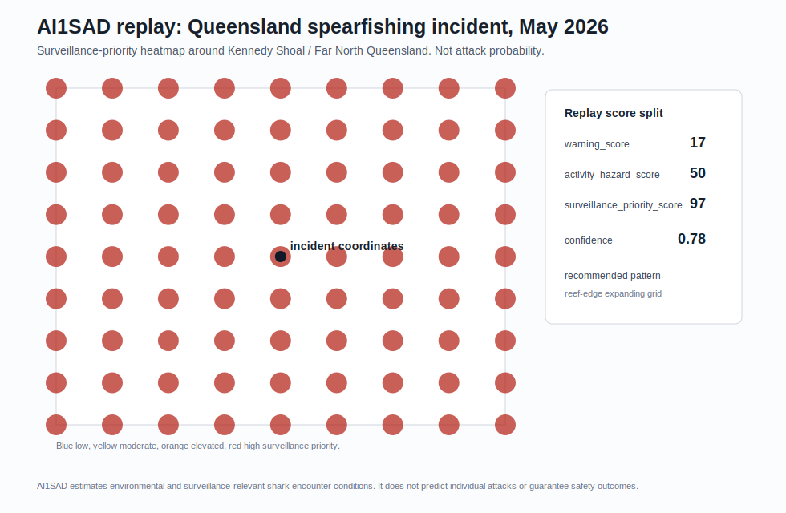

# Queensland Spearfishing 2026 Replay

AI1SAD did not claim an attack probability. It separated low general environmental warning from high surveillance priority based on activity, habitat, regional species suitability, and reef context.

## Incident Context

- Coordinates: `-18.082164764, 146.448303222`
- Approximate region: Kennedy Shoal / Great Barrier Reef, Far North Queensland, Australia
- Replay timestamp: `2026-05-24T08:00:00Z`
- Activity context: spearfishing from a private vessel
- Habitat context: shallow tropical reef / dropoff operating area
- Likely operational species context: tiger shark and bull shark suitability

Public reporting described the incident as a fatal shark encounter involving a spearfisher at Kennedy Shoal in Far North Queensland. The replay intentionally avoids victim names, private notes, exact vessel details, or any restricted-source content. Public context references: [ABC News](https://www.abc.net.au/news/2026-05-24/hull-heads-shark-bite/106715896) and [AP News](https://apnews.com/article/6c339de8223f6c42c10e5024cfaebc87).

## Environmental Context

This replay uses deterministic inputs from the current AI1SAD model, not live hindcast weather/ocean provider pulls:

- Rainfall/runoff: dry replay input, `rainfall_72h_mm=0.0`
- River mouth proximity: offshore reef context, modeled as `30.0 km`
- Sea surface temperature: warm tropical water, `29.0 C`
- SST anomaly: low anomaly context, `0.2 C`
- Vessel/fishing activity: moderate operating context, `0.35`
- Human exposure: limited offshore exposure, `0.28`
- Biological context: generic public reef/prey habitat context, not a carcass, fish kill, or verified bait event

## Replay Outputs

| Output | Score | Band | Interpretation |
| --- | ---: | --- | --- |
| `warning_score` | `16.64` | low | Environmental/live-condition warning stayed low because no rainfall/runoff, river-mouth, carcass/fish-kill, or strong live provider signal was present. |
| `activity_hazard_score` | `50.00` | elevated | Spearfishing plus catch/reef/dropoff context raised the activity-specific hazard score. |
| `surveillance_priority_score` | `96.86` | high | Drone/search prioritization rose strongly from spearfishing, reef habitat, and Queensland tiger/bull shark operational suitability. |

Supporting artifacts:

- [Replay JSON](../assets/case_studies/queensland_spearfishing_2026_replay.json)
- [Surveillance heatmap JSON](../assets/case_studies/queensland_spearfishing_2026_heatmap.json)
- [Factor contribution summary](../assets/case_studies/queensland_spearfishing_2026_factors.json)

## Dominant Factors

Surveillance priority was driven by:

- `regional_species_suitability`: `22.00` points
- `activity_hazard_score`: `17.50` points
- `activity_context`: `14.00` points
- `queensland_tiger_bull_reef_spearfishing_context`: `14.00` points
- `reef_dropoff_habitat_proximity`: `13.00` points
- `regional_species_match`: `8.00` points

Warning score was driven by lower-weight environmental context:

- `sst_score`: `5.00` points
- `fishing_vessel_activity_score`: `3.50` points
- `human_exposure_score`: `3.36` points
- `biological_event_score`: `2.75` points
- `regional_high_attention_month`: `1.23` points

## Confidence Breakdown

- Overall confidence: `0.8751`
- Confidence band: high
- Coverage confidence: `0.7778`
- Freshness confidence: `1.0000`
- Completeness confidence: `0.8800`

Present sources in this deterministic replay: weather observations, ocean observations, vessel activity, biological events, human exposure estimates, reef features, and regional risk profiles.

Missing sources: recent interactions and sighting reports. This matters operationally: the model elevated surveillance priority from activity/habitat/species context, not from a verified sighting cluster.

## Quiet-Day Comparison

| Metric | Incident Replay | Quiet-Day Baseline |
| --- | ---: | ---: |
| warning_score | `16.64` | `15.77` |
| warning_band | low | low |
| delta | `0.87` | n/a |

Quiet-day interpretation: conditions were near quiet-day baseline for general environmental warning. The important split is that surveillance priority was high while environmental warning remained low.

## Operational Interpretation

For drone operators and coastal safety teams, this replay would not have said "attack likely." It would have said:

- General environmental warning is low.
- Activity hazard is elevated because spearfishing changes the human-side context.
- Surveillance priority is high around reef/dropoff habitat because spearfishing, reef structure, and regional tiger/bull shark suitability overlap.
- Recommended pattern: reef-edge expanding grid.

This is the exact distinction AI1SAD is designed to preserve: low general warning can still produce high operational search priority for a specific activity and habitat context.

## Disclaimer

AI1SAD estimates environmental and surveillance-relevant shark encounter conditions. It does not predict individual attacks or guarantee safety outcomes. This replay is not an attack probability estimate, not a safety clearance, and not a substitute for local lifeguard, maritime, wildlife, weather, or emergency guidance.
