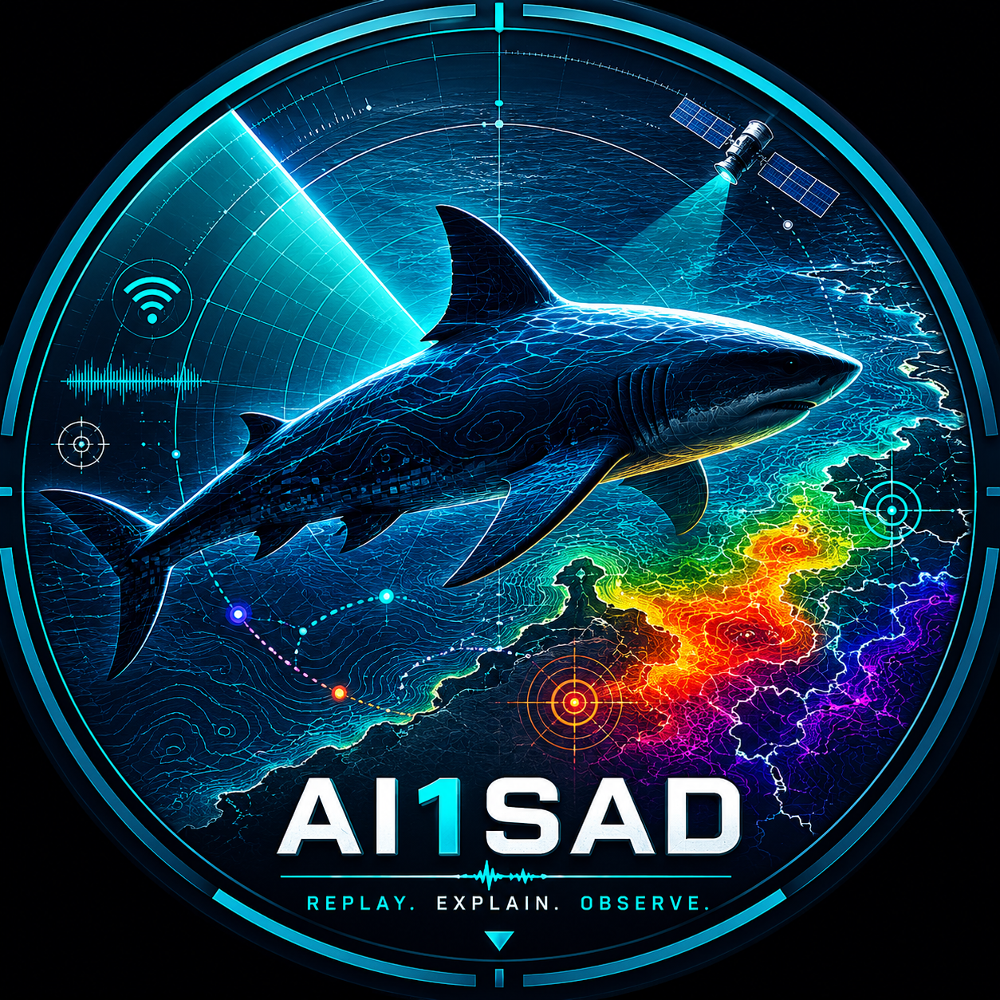
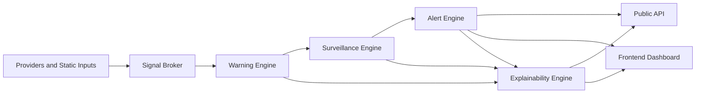

# AI1SAD

<section class="ai1sad-hero">
  
  <div class="ai1sad-hero-copy">
    
    <div>
      <h2>Environmental &amp; Operational Marine Intelligence</h2>
      <p>Replay • Explain • Observe</p>
    </div>
  </div>
</section>

## All in 1 Shark Attack Data

AI1SAD is a global shark encounter warning and environmental risk analysis platform.

The project combines historical incident records, environmental/ocean conditions, regional seasonality, weather and rainfall patterns, vessel and fishing activity, biological event signals, human exposure estimates, replay validation, surveillance prioritization, alerts, and explainability.

AI1SAD does not predict individual shark attacks. It estimates stacked environmental, biological, regional, operational, and human-activity conditions that may be relevant to shark encounter awareness and coastal safety planning.

## Mission

AI1SAD helps researchers, drone operators, beach managers, public-safety teams, and API users understand why a location, activity, alert, or surveillance zone was flagged.

The system is designed to be deterministic, explainable, privacy-preserving, and careful about uncertainty. It separates general environmental warning from activity hazard and operational surveillance priority.

## What AI1SAD Does

<div class="ai1sad-card-grid">
  <a class="ai1sad-card" href="REPLAY_LIBRARY/">
    <strong>Replay Library</strong>
    <span>Evidence-backed historical and demo scenarios with quiet-day comparisons.</span>
  </a>
  <a class="ai1sad-card" href="OPERATIONAL_MAPPING/">
    <strong>Operational Mapping</strong>
    <span>Map-first review of surveillance zones, heatmap cells, and regional context.</span>
  </a>
  <a class="ai1sad-card" href="EXPLAINABILITY_ENGINE/">
    <strong>Explainability</strong>
    <span>Factor contributions, confidence, freshness, and recommended operating patterns.</span>
  </a>
</div>

- Normalizes public shark incident records into a privacy-preserving data model.
- Combines public environmental, regional, biological, vessel/fishing, and human-exposure signals.
- Produces encounter-condition warning scores and surveillance-priority scores.
- Supports replay validation against known incident and quiet-day scenarios.
- Uses regional and species-aware rule packs rather than one global seasonal model.
- Generates alerts for operational review when warning, activity, surveillance, or event signals justify attention.
- Explains factor contributions, confidence, data freshness, missing sources, active rules, and recommended operating patterns.

## What AI1SAD Is Not

- Not an individual attack predictor.
- Not a beach closure authority.
- Not individual intent inference.
- Not a substitute for local lifeguards, emergency services, wildlife agencies, marine agencies, weather offices, or beach managers.
- Not a safety guarantee for entering the water.
- Not a source for publishing victim names, private notes, restricted data, or unreviewed operational records.

## Core Systems

AI1SAD is organized as a set of explainable services:

- **Signal Broker**: normalizes weather, ocean, vessel, biological, human exposure, and event context into common signal records.
- **Warning Engine**: estimates environmental/live-condition encounter warning.
- **Activity Hazard Layer**: separates human activity context such as spearfishing, diving with catch, fishing, or swimming near bait activity.
- **Surveillance Engine**: prioritizes drone/search zones using activity, habitat, recent interactions, sightings, regional species profiles, and current signals.
- **Alert Engine**: turns warning, activity, surveillance, and event conditions into actionable alert objects.
- **Explainability Engine**: explains why outputs were produced and what data limits confidence.
- **Replay Engine**: validates deterministic model behavior against known scenarios and quiet-day comparisons.
- **Frontend Shell**: visualizes API outputs without duplicating scoring logic in the browser.



## Replay Validation

Replay validation keeps AI1SAD grounded. Built-in scenarios compare incident-day context against quiet-day baselines, signal decay, confidence decomposition, and surveillance heatmaps.

Start with:

- [Replay Validation](REPLAY_VALIDATION.md)
- [Horseshoe Reef 2026](CASE_STUDY_HORSESHOE_REEF_2026.md)
- [Queensland Spearfishing 2026](case_studies/queensland_spearfishing_2026.md)

## Regional Packs

AI1SAD uses regional packs so Florida, Hawaii, Western Australia, New South Wales, South Africa, the Red Sea, and other regions can carry different species context, seasonal calendars, environmental triggers, alert rules, and replay scenarios.

Start with:

- [Regional Packs](REGIONAL_PACKS.md)
- [Pack Entitlements](PACK_ENTITLEMENTS.md)
- [Regional Risk Profiles](REGIONAL_RISK_PROFILES.md)
- [Species Season Profiles](SPECIES_SEASON_PROFILES.md)

## Provider Stack

The provider stack is intentionally incremental. Some providers are live or adapter-ready; others remain controlled static/manual placeholders until terms, reliability, and public-use boundaries are reviewed.

Provider docs:

- [Current Data Sources](CURRENT_DATA_SOURCES.md)
- [Signal Broker](SIGNAL_BROKER.md)
- [Provider Health](PROVIDER_HEALTH.md)
- [Open-Meteo Provider](OPEN_METEO_PROVIDER.md)
- [NOAA/NWS Provider](NOAA_NWS_PROVIDER.md)
- [SST Provider](SST_PROVIDER.md)
- [Human Exposure Provider](HUMAN_EXPOSURE_PROVIDER.md)
- [Biological Events Provider](BIOLOGICAL_EVENTS_PROVIDER.md)
- [Vessel and Fishing Provider](VESSEL_FISHING_PROVIDER.md)

## Alerts And Explainability

Alerts are operational review objects. They include recommended actions, expiration, confidence, dominant factors, data freshness, and disclaimers.

Explainability responses describe factor contributions, missing data, regional pack influence, active rules, suppression reasons, and operational interpretation text.

Start with:

- [Alert Engine](ALERT_ENGINE.md)
- [Alert Levels](ALERT_LEVELS.md)
- [Explainability Engine](EXPLAINABILITY_ENGINE.md)
- [Operational Recommendations](OPERATIONAL_RECOMMENDATIONS.md)
- [Confidence Interpretation](CONFIDENCE_INTERPRETATION.md)
- [Human Override](HUMAN_OVERRIDE.md)

## API Quickstart

Core API references:

- [API Reference](API.md)
- [Schema](SCHEMA.md)
- [Privacy](PRIVACY.md)
- [MongoDB](MONGODB.md)
- [API Access Tiers](API_ACCESS_TIERS.md)

Example local run:

```powershell
pip install -r requirements.txt
uvicorn app.main:app --reload
```

Example explanation request:

```text
GET /api/v1/explain/location?lat=-31.9826564&lon=115.5153234&activity_context=spearfishing&suspected_species=white%20shark
```

## Frontend

The dashboard shell visualizes existing backend responses. It should not implement scoring, warning, alert, replay, or regional-pack rules in the browser.

- [Frontend Dashboard](FRONTEND_DASHBOARD.md)

## Safety Notice

AI1SAD estimates environmental and surveillance-relevant shark encounter conditions. It does not predict individual attacks or guarantee safety outcomes.

Always follow local lifeguard, beach-closure, marine agency, wildlife, weather, maritime, and emergency guidance.

[](https://devglobe.app/projects/ai1sad?utm_source=badge&utm_medium=embed)
